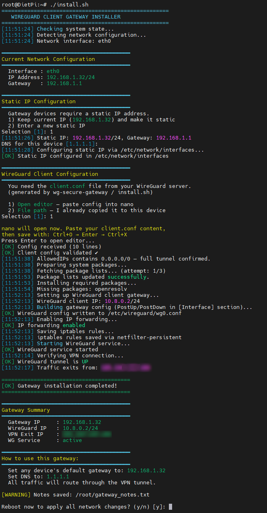

# 🌐 WireGuard Client Gateway

<div align="center">



**Turn any Raspberry Pi or Debian device into a WireGuard VPN gateway for your entire network.**

[English](README.md) | [Türkçe](README_TR.md)

[](LICENSE)
[](install.sh)

</div>

---

## 📖 What is this?

A bash script that turns a **Raspberry Pi** (or any Debian-based device) into a **VPN gateway** for your local network. Once set up, any device on your network can route its traffic through the VPN — just by changing its default gateway.

> **Need the server first?** This script requires a `client.conf` from a WireGuard server. Set one up with 👉 [wg-secure-gateway](https://github.com/sinezty/wg-secure-gateway)

## 🧭 How It Works

```
┌──────────────────┐       ┌───────────────────┐       ┌──────────────┐
│   Your Devices   │       │   Raspberry Pi    │       │  VPN Server  │
│                  │       │   (this script)   │       │              │
│  Phone, PC,      │──────▸│                   │══════▸│  Public IP   │──▸ Internet
│  Smart TV, etc.  │  LAN  │  Gateway IP:      │  WG   │  of server   │
│                  │       │  192.168.1.x      │ Tunnel│              │
│ GW: 192.168.1.x  │       │                   │       │              │
└──────────────────┘       └───────────────────┘       └──────────────┘
```

1. **Install** this script on your Raspberry Pi
2. **Import** the `client.conf` from your VPN server
3. **Point** any device's default gateway to the RPi's IP
4. ✅ All traffic now flows through the encrypted VPN tunnel

## ✨ Features

- 🌐 **Full Network Gateway** — Any LAN device can use the VPN, no software needed on clients
- 📡 **Static IP Setup** — Auto-detects DHCP IP, converts to static (dhcpcd / netplan / interfaces)
- 📂 **Config Import** — Paste contents or specify file path, with format validation
- 🔀 **Automatic NAT** — IP forwarding + MASQUERADE rules handled automatically
- 💾 **Persistent Rules** — iptables rules saved across reboots
- ✅ **Connection Verify** — Automatic tunnel and public IP check after setup
- 🔄 **Re-runnable** — Safe to run again if something goes wrong, cleans previous config
- 🖥️ **Multi-Platform** — Raspbian, DietPi, Debian 11+, Ubuntu 20.04+

## 🚀 Quick Start

> ⏱️ Installation takes approximately **2–3 minutes**.

### Step 1: Set up a VPN Server

If you haven't already, set up a WireGuard server and get a `client.conf`:

```bash
# On your remote VPS/server:
curl -fsSL https://raw.githubusercontent.com/sinezty/wg-secure-gateway/main/install.sh | sudo bash
```

### Step 2: Copy `client.conf` to your RPi

```bash
# From your server to your RPi:
scp /etc/wireguard/client.conf pi@<RPI_IP>:~/client.conf
```

### Step 3: Run this script on the RPi

```bash
curl -fsSL https://raw.githubusercontent.com/sinezty/wg-client-gateway/main/install.sh | sudo bash
```

## 📦 Alternative Installation

```bash
# Download first, then run
wget https://raw.githubusercontent.com/sinezty/wg-client-gateway/main/install.sh
chmod +x install.sh
sudo ./install.sh
```

## ⚙️ Configuration

The script interactively configures:

| Setting | Default | Description |
|---------|---------|-------------|
| Static IP | Current DHCP IP | Keep your current IP or enter a new one |
| Subnet | Auto-detected | CIDR notation (e.g. /24) |
| Gateway | Auto-detected | Your router's IP address |
| Device DNS | 1.1.1.1 | DNS for the gateway device itself |
| client.conf | — | Path to your WireGuard client config |

## 📋 What Happens During Installation

```
1. System Checks      → Root, existing configs
2. Network Detection  → Interface, IP, subnet, gateway
3. Static IP Setup    → DHCP → Static (dhcpcd / netplan / interfaces)
4. Config Import      → Validates [Interface] + [Peer] + PrivateKey
5. Package Install    → wireguard, iptables, iptables-persistent
6. IP Forwarding      → net.ipv4.ip_forward = 1
7. NAT Rules          → MASQUERADE via PostUp/PostDown
8. Service Start      → wg-quick@wg0 enabled
9. Verification       → Tunnel status + public IP check
```

## 📱 Using the Gateway

After installation, just change the **default gateway** on any device:

### 🖥️ Windows
`Settings` → `Network` → `IPv4` → `Gateway`: **RPi IP address**

### 🐧 Linux
```bash
sudo ip route replace default via <RPi_IP>
```

### 🍎 macOS
`System Preferences` → `Network` → `Advanced` → `TCP/IP` → `Router`: **RPi IP address**

### 📱 iPhone / Android
`Wi-Fi Settings` → `Configure IP` → `Manual` → `Router/Gateway`: **RPi IP address**

### 🌐 Router (Best Option)
Set the RPi IP as the **default gateway** in your router's DHCP settings → **all devices** automatically route through VPN. No per-device setup needed!

## 📁 Generated Files

| File | What it is |
|------|------------|
| `/etc/wireguard/wg0.conf` | Client config with gateway NAT rules |
| `/var/log/wg_client_setup.log` | Full installation log |
| `/root/gateway_notes.txt` | Setup summary & usage instructions |
| `/etc/sysctl.d/99-wg-gateway.conf` | IP forwarding config |

## 🧰 Under the Hood

The script takes the `client.conf` generated by the server and converts it into a gateway configuration:

```
Server (wg-secure-gateway)           Client (wg-client-gateway)
┌─────────────────────┐              ┌─────────────────────────┐
│ /etc/wireguard/     │    copy      │ /etc/wireguard/         │
│   client.conf       │ ──────────▸  │   wg0.conf              │
│                     │              │   + PostUp/PostDown     │
│                     │              │   + NAT MASQUERADE      │
│                     │              │   + AllowedIPs check    │
└─────────────────────┘              └─────────────────────────┘
```

- Server's `client.conf` → becomes client's `/etc/wireguard/wg0.conf`
- Script adds **PostUp/PostDown** gateway NAT rules into the `[Interface]` section
- Validates **AllowedIPs = 0.0.0.0/0** (required for full tunnel gateway mode)
- If existing PostUp/PostDown exist in the config, they are replaced with gateway rules

> 💡 **Re-run safe**: If you made a mistake or want to reconfigure, just run the script again. It will stop the existing service, clean old iptables rules, and apply fresh settings.

## 💻 Requirements

- **Devices**: Raspberry Pi, any Debian-based SBC or mini PC
- **OS**: Raspbian, DietPi, Ubuntu 20.04+, or Debian 11+
- **Access**: Root or sudo privileges
- **Network**: Active internet + LAN connection
- **VPN Server**: A `client.conf` from a WireGuard server

## 🔗 Related Projects

| Project | Description |
|---------|-------------|
| 👉 **[wg-secure-gateway](https://github.com/sinezty/wg-secure-gateway)** | Set up the WireGuard VPN server that this gateway connects to |

## 🤝 Contributing

Pull requests are welcome. For major changes, please open an issue first to discuss.

## 📝 License

MIT

## 👤 Author

BarışY
